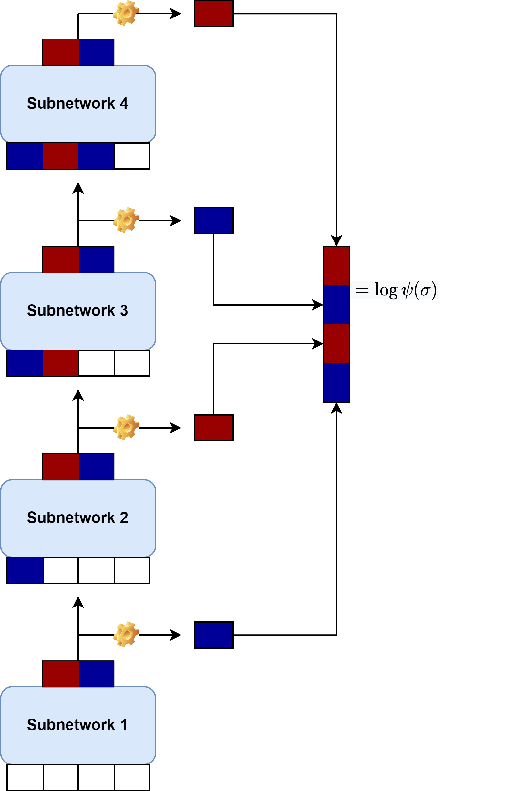

# NAQS

## Intro

This respository contains tools to apply Neural Network Quantum States (NNQS) to quantum chemistry tasks. It follows the work of [Barett et al.](https://arxiv.org/pdf/2109.12606.pdf) and enables calculations with autoregressive NADE models, recurrent neural networks (RNN) models and restricted Boltzmann machines. The implementation is based on the [NetKet](https://www.netket.org/) package and enables fast execution on GPU and CPU via [Jax](https://jax.readthedocs.io/en/latest/#).

## Setup

The calculation requires `python >= 3.7` (eventually <= 3.10) the [NetKet Version 3.3.2](https://netket.readthedocs.io/en/latest/docs/install.html) and [OpenFermion](https://quantumai.google/openfermion/install) package following the instructions in the links. To install the package including dependencies, please run `pip install --user -e .` . If you want to use utils to track calculations, add the scripts directory to your PATH variable. All code implemented in this work can be found in the [arnn](arnn/) section, the molecular data saved as OpenFermion operators is provided in the [data](data/) section. The molecular data is obtained from Hartree-Fock calculations using [Openfermionpsi4](https://github.com/quantumlib/OpenFermion-Psi4), currently integrals for small molecules with up to 28 spatial orbitals (C2_pvdz) are provided here. If not otherwise stated by the filename, a minimal STO-3G basis is used in the calculation. Note that only systems up to the size of Li2O have been thoroughly tested and larger calculations are not recommended. 
In [scripts](scripts/) the run scripts as well as two basic tools for monitoring the optimization are provided:
- `scripts/energy.py` outputs the variational energies of the last steps
- `scripts/plot.py` creates a basic plot of the optimization run versus a reference value. 
To run NAQS optimizations, use the provided `run_MODEL.sh`files or set up own calculations using the provided options, a comprehensive list of options can be obtained by typing `scripts/MODEL.py --help`.

During the optimization, all data is stored in Json .log files, which can be opened in python via `json.load(open(FILENAME)))` and provide a dictionary with all monitored quantities.

## Models 

The repository offers the oportunity to compare different NAQS models on the same footing. More specifically, [RBMs](https://www.nature.com/articles/s41467-020-15724-9.pdf?origin=ppub) and [NADE](https://arxiv.org/pdf/2109.12606.pdf) architectures, which have been applied in previous NAQS for quantum chemistry studies, as well as a dilated stacked recurrent model which has been applied to [spin models](https://journals.aps.org/prresearch/pdf/10.1103/PhysRevResearch.2.023358) recently. 
For all models we use slater determinants as input data, which are encoded by the occupation number of the spin orbitals. The output of a NNQS is the log amplitude of a slater determinant while the phase is obtained by a second helper network (NADE, RNN) or from the complex part of the amplitude (RBM). For details about the optimization procedure read [here](https://www.science.org/doi/abs/10.1126/science.aag2302?cookieSet=1) and for a detailed discussion for quantum chemistry application check out this [review](https://arxiv.org/pdf/2208.12590.pdf).

### RBM
A restricted Boltzmann machine is a probabilistic model, displayed below .
 
This model is realized as a feed-forward network with a single, fully connected hidden layer. The size of the hidden layer gives a controllable paramter to increase the accuracy of the model. Since the model is non-normalized, expectation values and gradients are evaluated using variational Monte Carlo (VMC). Therefore it requires a Markov Chain Monte Carlo sampler, which is chosen as MetropolisExchange as standard sampler. This choice ensures the conservation of the total electron number. Since the unnormalized model does not allow a truncation of the hilbert space and efficient sampling, the expectation values are evaluated by calculating N^4 matrix elements and amplitudes, which is extremely costly. Therefore RBM calculations are only recommended for the smallest systems. 
On the other hand, due to the low number of parameters, the application of powerful optimization techniques like stochastic reconfiguration (SR) is feasible for RBMs.
The structure of the RBM calculation is applicable to all types of networks, therefore the RBM can be freely interchanged with other models following the instructions on the NetKet website, but make sure to include complex parameters in some way. 

TL;DR --> Most important parameters:
- hidden layer density --> Number of variational parameters
- sample number --> MCMC samples, has to be very large in orde rto give good results
- Preconditioner: Default SR  

### NADE
A NADE is a set of single layer feed-forward networks as depicted below.

Each subnetwork represents one or more spin orbitals. The output of a subnetwork is a set of log pobabilities, each corresponding to a given configuration of occupation numbers of the represented spin orbital. In the simplest case, a subnetwork represents a single spin orbital and outputs two probabilities, since the orbital is either occupied or not occupied. For N spin orbitals, the number of output units equals 2^N. The subnetworks are sequentially evaluated and therefore exhibit a autoregressive property. This has some advantages: By normalizing and masking the output of each subnetwork, the total wave function is normalized and physical constraints,e.g. partticle number conservation, are automatically included. By sampling occupation numbers step by step, the samples with the lowest probabilities can be truncated after each step in order to give only the samples wih the highest probability, and due to the normalization we don't have to resample states. 
Furthermore, states which are not sampled can be truncated with a rather small error (controlled by the sample size). This enables the calculation of local energies in the subspace of sampled states, which is much more efficient compared to calculating the exact local energies. 
In order to reduce the computational cost, the parameters are chosen real and the phase is calculated using a second, large helper network.

TL;DR --> Most important parameters:
- Number of **spatial** orbitals per subnetwork --> Minimum 1, increases the cost for sampling, lowers the memory cost for deep models, influence on the accuracy is unknown
- Number of unique samples --> Maximum viable Hilbert space size
- Number of hidden units --> Hidden layer size of the subnetworks, controls number of variational parameters
- Sampling Buffer --> The sampling introduces a bias, can be reduced by using a buffer --> increases sampling cost
- Orbital ordering --> Strong effect on accuracy due to sequential approximation, inverse ordering gives good results
- for more informations, type `scripts/nade.py --help

### RNN
A recurrent network is commonly used in sequence modelling and can capture correlations by passing a memory vector from cell to cell. If applied to a sequence of occupation numbers, it obey the autoregresssive property and allows for efficient sampling similar to NADE. In this implementation, we use a recurrent netowrk with shared weights constructed from a dense input layer, three recurrent layers and a dense output layer. For more information on recurrent neural network wave function please see the paper of [Hibat-Allah](https://journals.aps.org/prresearch/pdf/10.1103/PhysRevResearch.2.023358). 

TL;DR --> Most important paramters:
- The same as NADE (both autoregressive)
- feature size applies only to dense input and phase layers
- new parameter: memory size --> number of units in a recurrent layer, also size of the passed memory vector

## Optimization

For convenience, simply use the provided run_MODEL.sh scripts via `run_MODEL.sh NAME N_ELECTRONS MULTIPLICITY N_ORBITALS SEED SUBSIZE`. The required inputs are:
- NAME: Name of a molecule, a Name.hdf5 file should be in data/
- N_ELECTRONS: number of electrons
- MULTIPLICITY: multiplicity, eigenvalue of the S^2 operator (default 0)
- N_ORBITALS: Number of **spatial** orbitals
- SEED: seed for the random initialization
- SUBSIZE: number of spatial orbitals combined in a subnetwork, only required for NADE and RNN

A comprehensive overview over the required parameters i given in the paper of [Barett](https://arxiv.org/pdf/2109.12606.pdf) in Table I.
More optimization specific settings, e.g. number of samples, learning rate, etc.,  can be set in the .sh files. For all avaialble options read the --help option of the /scripts/model.py files. 
As a minimal example, run `run_MODEL.sh H2 2 0 2 111`.

## Preoptimization
It is possible to train autoregressive models towards an approximate wave function (e.g. from a MP2 or CISD calculation). This is included in the option pretraing option, the target wawve function can be set in the model.py files. The training is performed until a given overlap is reached or to a maximum of 20000 steps Note that preoptimizations for larger systems can take some time since the MP2 and CISD impleemntations are inefficient.

